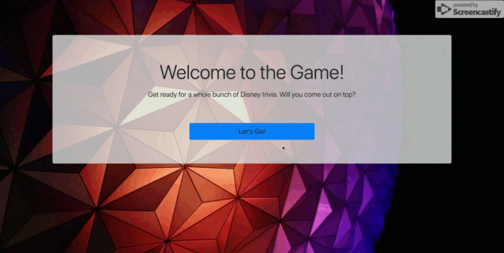

# Quiz-Game

This application is designed to walk the user through a series of trivia questions, and to present a score at the end. Each question is allotted 15seconds— with correct answers adding time to the clock, and incorrect answers subtracting time. The user's time remaining at the end of the questions is their final score.

## Interface
As this is a game, I designed the UI to be fun but not distracting. There is an animated countdown before the gameplay begins.

Additionally, during gameplay, each button plays a sound (one sound for correct answers, and one for incorrect.)

At the end of the quiz, the user's score is displayed, and they are given the opportunity to record their score in the game's highscores section.

## Technologies

This site was written using:
* Bootstrap 4
* Javascript

## Credits

In setting up this project, I closely followed the guidelines provided by the [UCF Coding Bootcamp](https://github.com/UCF-Coding-Boot-Camp/UCF-ORL-FSF-FT-11-2019-U-C).

My background image was found on [unsplash.com](https://unsplash.com/), and all audio came from my subscription to [audioblocks.com](https://www.audioblocks.com/).

Also, the countdown element in this quiz was written by (and only lightly adapted from)[Florin Pop](https://codepen.io/FlorinPop17/pen/LzYNWa).